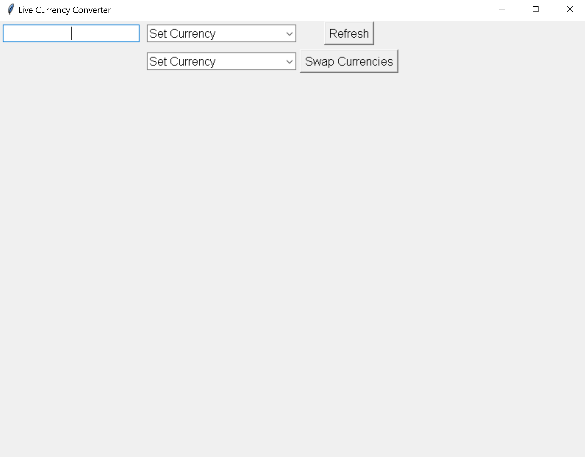
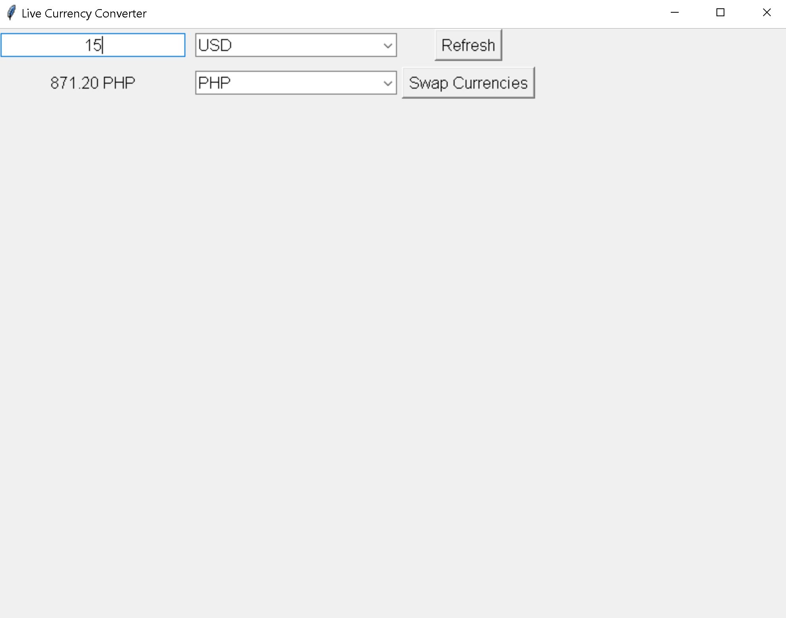
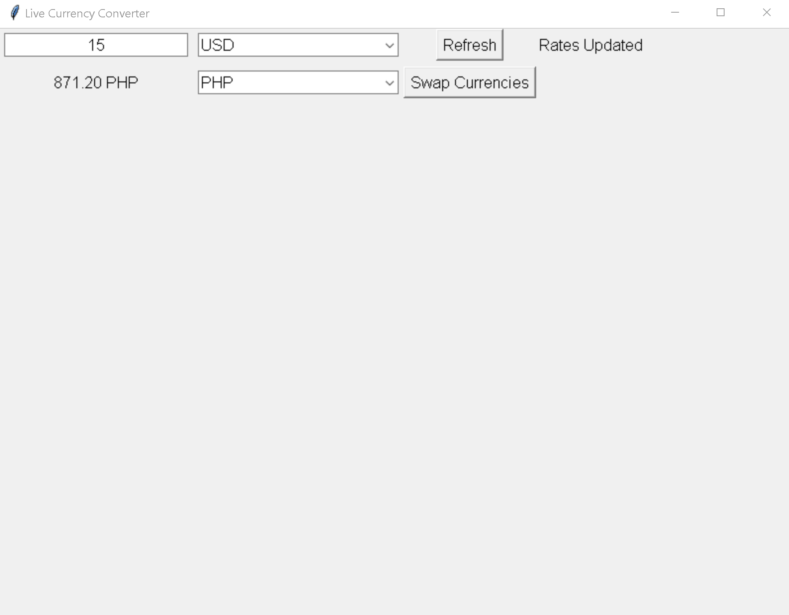

# Live Currency Converter (Tkinter)

A real-time currency converter desktop application built using Python and Tkinter.

> Features

- Live exchange rates from ExchangeRate API
- Real-time conversion updates
- Currency swapping
- Manual refresh with status indicator
- Error handling for failed API requests

> Tech Stack

- Python
- Tkinter (GUI)
- Requests (API calls)

> Installation

-Clone the repository:

git clone https://github.com/krebs-hub/Live-Currency-Converter

-Navigate into the folder:

cd Live-Currency-Converter

-Install dependencies:

pip install -r requirements.txt

-Run the application:

python main.py

> Screenshot

---

> Purpose

This project was built to practice:
- Object-Oriented Programming (OOP)
- API integration
- Event-driven GUI development
- Clean project structure

---

> Future Improvements

- Automatic background refresh
- Threaded API calls
- Improved UI styling
- Base currency selection